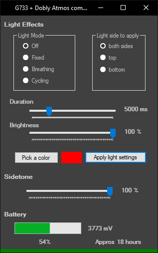
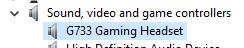
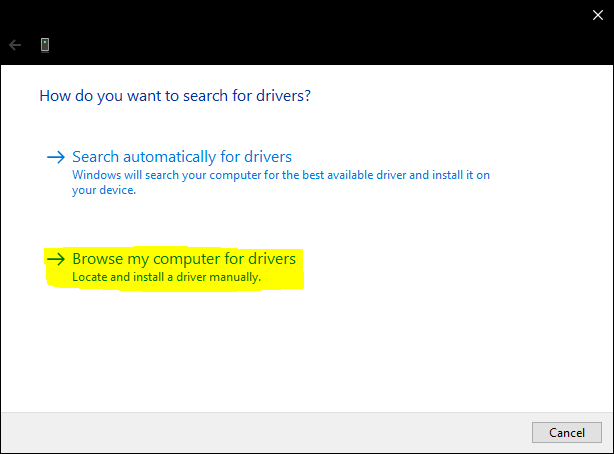
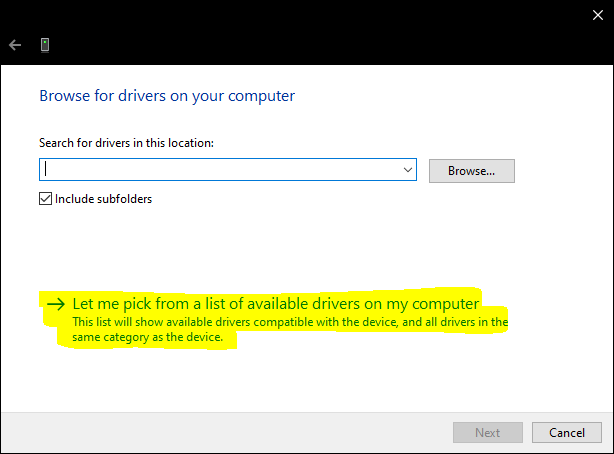
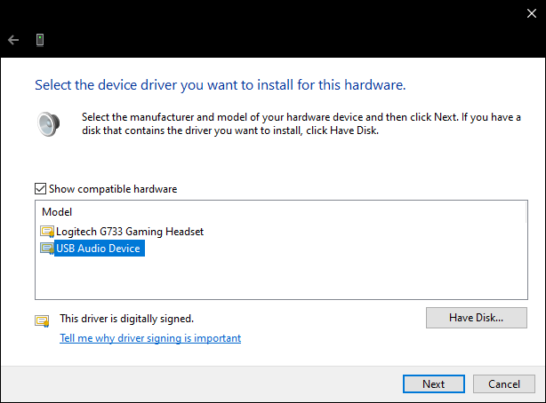

# G733_windows_app

[Introduction](#introduction)  
[Some Reverse...](#some-reverse)  
[The Software](#The-Software)  
[How to use "Basic" logitech drivers](#How-to-use-Basic-logitech-drivers)  

## Introduction

#### Why ???

Upgrading from a G430 soundcard (which served me well during ... 6++ years !) to a G733 (finally a "big" battery life and light WIRELESS headset) I've been disappointed seeing that Logitech doesn't offer Dolby anymore (Only the DTS X 2.0, which is crap)
I've looked at ways to get Dolby back, Dolby Access on W10 seems to bring the same functionalities, and even more !

Well if you already tried this, you know that something weird is going on between Dolby Atmos and Logitech drivers... I don't know what happened between them, I don't even want to know but the result is ... you get NO SOUND once Dolby is enabled. If you disable Dolby, everything comes back to life.

If you have searched a bit for similar issues on internet, you probably ended on some reddit posts suggesting to use the "generic" / "fail safe" driver from Logitech instead of the fancy one. And it works ! If you use this one, Dolby is working great. BUT ! Here's the issue. G-hub is not working anymore... What does this means ? Lights are always cycling ON as soon as the headset is turned on. You CAN'T set your Sidetone value. You CAN'T get your battery level. Well, that's a no for me.

I need to be able to turn off the lights as they have a big impact on battery life, + I can see them which is quite disturbing. Can't speak of people wearing glasses, it would drives me crazy to get lights to reflect into them.

I need to be able to setup the Sidetone. Default value is 0. If I use this headset on 0 I'm going to speak louder and my neighbors are gonna hate me (Well, they might already) On G430 soundcard the driver provided the ability to set this up in windows sound panel, here, forget about it.

I need to know what's my battery level ! That's important and there is no way to check battery level within the headset itself like other brands. (Well, at least my Sony XM3 does this, very convenient)

I can't live with DTS X 2.0. Sound is shitty, really, I mean....  Really.
I can't live with Stereo only. May sound stupid but I use Dolby since 6++ years and it sounds veeeerry good in video games.

Update on 11 jan 2021 : Did a lot of tests and comparison between my old headset and the new one (especially between the "old dolby" and dolby atmos with this trick) and this method is nowhere as good as my old headset. At least some games don't support this at all. (Rust for example) It may be related to how the sound peripheral is detected by the game. My old headset is detected as a 7.1 system, which should trigger something in unity (I guess), whereas this method downgrades the headset driver to a stereo headset. It results in NO front/rear separation in these games which kills the immersion.

Final Note : I'm currently thinking about returning my headset. I was motivated to start disassembling drivers and look at "how it works" under the hood as both my headsets use the same driver (and one can use dolby properly) but other things hold me back. There's some static noise happening when you try to play some harmonics together (like very low freq + very high freq). It can be heard in game and while playing songs and is really annoying... Tested on W10, Linux, with logitech "fancy" & "basic" drivers. It seems to be related to how the sound is compressed to be sent over the air and really kills the experience. I highly doubt that it's related to my unit only.

#### TL;DR

G733 without Dolby :
- Ghub features (Lights, Sidetone, Battery, etc)
- DTS-X 2.0 or Stereo
- Good battery life if you turn lights off

G733 with Dolby :
- No Ghub features (Lights, Sidetone, Battery, etc)
- DOLBY !
- Poor battery life as you can't turn lights off

How to get Ghub features + Dolby ? Create a Ghub clone and use "basic" Logitech drivers

## Some reverse...

#### Lights

Raw frames etc have been deleted as they are unnecessary here. But here is how it works (as far as I understand)

20 bytes frames are sent and received from headset

Features are addressed by 2 bytes long IDs :
- Lights ID :   0x043e
- Sidetone ID : 0x071e
- Battery ID write :  0x080e
- Timeout ID : 0x082e (needs to be implemented and tested)

It appears that the least significant 4 bits are not important. For example, if you want to set lights setting you can use :
- 0x04a
- 0x04b
- 0x04c
- 0x04d
- 0x04e
- 0x04f

It doesn't seem to matter. I've used "e" everywhere as this is what I got from my headset they day I dumped my frames. (But got "f" the previous day)

Start by filling a 20 bytes long buffer with 0x00, then fill the buffer with corresponding informations ( "-" are untouched bytes, leave 0x00)

| Byte | 0 | 1 | 2 | 3 | 4 | 5 | 6 | 7 | 8 | 9 | 10 | 11 | 12 | 13 |
|------|---|---|---|---|---|---|---|---|---|---|----|----|----|----|
| lights off | 0x11 | 0xff | 0x04 | 0x3e | side | - | - | - | - | - | - | - | - | - |
| fixed lights | 0x11 | 0xff | 0x04 | 0x3e | side | 0x01 | R | G | B | 0x02 | - | - | - | - |
| breathing lights | 0x11 | 0xff | 0x04 | 0x3e | side | 0x02 | R | G | B | duration_msb | duration_lsb | - | brightness | - |
| cycling lights | 0x11 | 0xff | 0x04 | 0x3e | side | 0x03 | - | - | - | - | - |duration_msb | duration_lsb | brightness |
| Sidetone | 0x11 | 0xff | 0x07 | 0x1e | sidetone | - | - | - | - | - | - | - | - | - |
| Battery (write) | 0x11 | 0xff | 0x08 | 0x0e | - | - | - | - | - | - | - | - | - | - |
| Battery (read) | 0x11 | 0xff | 0x08 | 0x0e | volt_MSB | volt_LSB | state | - | - | - | - | - | - | - |

Side is one byte :
- top : 0x01
- bottom : 0x00

Duration is two bytes long :
- 1000ms = 0d1000 = 0x03e8 (MSB is 0x03 & LSB is 0xe8)
- 5000ms = 0d5000 = 0x1388 (MSB is 0x13 & LSB is 0x88)
- etc

Brightness is one byte long :
- 100% = 0d100 = 0x64
- 50% = 0d50 = 0x32

Sidetone is one byte long :
- 100% = 0d100 = 0x64
- 50% = 0d50 = 0x32

Colors are RGB value but these are scaled. I used polynomial trendline feature on excel and ended up with this :

scaled_color = -0.0086\*color + 0.0028\*color² + 0.000004*color³

Following this :
- 0d255 = 0d255 (scaled) = 0xff
- 0d200 = 0d147 (scaled) = 0x93
- 0d100 = 0d32 (scaled) = 0x20

Voltage is two bytes long  :
- 4000mV = 0d4000 = 0x0fa0 (MSB is 0x0f & LSB is 0xa0)
- 3800mV = 0d3800 = 0x0ed8 (MSB is 0x0e & LSB is 0xd8)

State is one byte long :
- 0x01 : Unplugged (Discharging)
- 0x03 : Cable just got inserted (Interrupt frame)
- 0x07 : Plugged (Charging)

## The software

I made a c# .net windows form app as it's quite easy to work with, and should be compatible with every W10 computer. (+ as an Embedded systems dev, I'm more into C code targeting Arm Cortex-M MCUs)

just open G733_Dolby_Atmos_companion.sln in Visual studio and you're good to go.

Or, you can [download](https://github.com/YulCmr/G733_windows_app/raw/main/G733_Dolby_Atmos_companion/G733_Dolby_Atmos_companion/bin/Release/G733_Dolby_Atmos_companion.exe) the last version and use it. You may face some bugs, but I hope community will help fix these.

Maybe someone with real knowledges in Windows app can make a sexier and more stable app.

## How to use "Basic" logitech drivers

1. Open your Device Manager
2. Right click -> Update Driver, on the logitech G733 device in the "Sound, video and game controllers" section, NOT the "Audio inputs and outputs"  

3. Clic "Browse my computer for drivers"  

4.Clic "Let me pick from a list of available drivers on my computer"  

5.Choose "USB Audio Device" instead of the Logitech one

6. Restart your computer (That's actually important)

Once you have installed and enabled Dolby Atmos, you may still have NO sound. Do this again WITHOUT restarting, you should be good.
